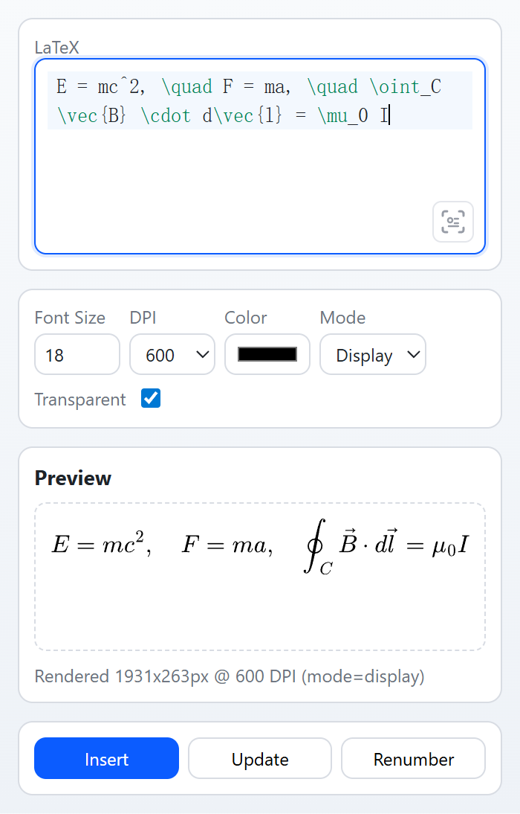

# SlideTeX

An offline PowerPoint add-in prototype for rendering LaTeX to PNG, inserting equations into slides, and supporting re-edit via metadata.

`Status`: prototype / work in progress (not production-ready)

Language: **English** | [简体中文](README.zh-CN.md)

## Features

- PowerPoint task pane for LaTeX input, preview, insert, and update.
- Equation insertion as embedded PNG, so decks remain viewable on machines without the add-in.
- Shape metadata persistence for round-trip edit/update workflows.
- MathJax-based rendering engine (no local LaTeX installation), exported through SVG-to-PNG.
- CodeMirror 6-based editor with syntax highlighting and completion.

## Screenshot

English WebUI preview:



## Repository Layout

- `src/SlideTeX.VstoAddin`: VSTO add-in (`net48`) runtime code.
- `src/SlideTeX.WebUI`: Task pane HTML/CSS/JS and vendored assets.
- `src/SlideTeX.Installer`: WiX-based installer project.
- `scripts`: build, packaging, and asset sync scripts.
- `tests`: all test scripts and fixtures.
  - `tests/render-regression`: visual rendering baselines and fixtures.
  - `tests/equation-numbering`: equation numbering known-good fixtures.
  - `tests/ocr-baseline`: OCR known image-LaTeX pair fixture.
  - `tests/lib`: shared test infrastructure utilities.
- `docs`: debugging, deployment, and regression guides.

## Requirements

### Runtime
- Windows 10/11
- Microsoft 365 PowerPoint (desktop). PowerPoint 2016/2019/2021/LTSC is expected to work but not fully validated in this repository.
- .NET Framework `4.8` Runtime
- WebView2 Runtime

### Build
- Node.js
- .NET Framework `4.8` Developer Pack
- Visual Studio 2022 (or MSBuild from VS installation)
- WiX Toolset `6.0.2`
- WiX extension `WixToolset.BootstrapperApplications.wixext` (for unified multilingual `.exe` bundle)

```powershell
wix extension add -g WixToolset.BootstrapperApplications.wixext/6.0.2
```

## Quick Start

1. Sync third-party assets:

```powershell
pwsh ./scripts/Sync-MathJax.ps1 -Version 4.1.0
```

Sync pix2text-mfr OCR model files (download from Hugging Face):

```powershell
pwsh ./scripts/Sync-MathJax.ps1 -Component pix2text-mfr -Pix2TextModelId "breezedeus/pix2text-mfr-1.5"
```

Sync all supported third-party assets:

```powershell
pwsh ./scripts/Sync-MathJax.ps1 -Component all
```

2. Generate inline i18n bundle after `src/SlideTeX.WebUI/assets/i18n/*.json` changes:

```powershell
node ./scripts/generate-webui-i18n-bundle.mjs
```

3. Build solution:

```powershell
& "C:\Program Files\Microsoft Visual Studio\2022\Community\MSBuild\Current\Bin\MSBuild.exe" SlideTeX.sln /m:1
```

4. Preview WebUI in browser (mock host):

Open `src/SlideTeX.WebUI/index.html` directly in a browser. The built-in `mock-host.js` provides a lightweight stub for all host bridge methods, logging calls to the console.

## Build and Test Commands

- Build installer:

```powershell
pwsh ./scripts/Build-Installer.ps1 -Configuration Release -Platform x64
```

When both `zh-CN` and `en-US` cultures are built, the script generates:

- language-specific MSI payloads (internal use);
- one unified installer bundle `.exe` that selects default language from system locale.

Language override at install time:

```powershell
.\SlideTeX-<version>-Release-x64.exe SlideTeXInstallerCulture=en-US
.\SlideTeX-<version>-Release-x64.exe SlideTeXInstallerCulture=zh-CN
```

- Build installer and override VSTO manifest certificate thumbprint (for CI pipelines that generate temporary certificates):

```powershell
pwsh ./scripts/Build-Installer.ps1 -Configuration Release -Platform x64 -VstoManifestCertificateThumbprint "<THUMBPRINT>"
```

- Unit tests (pure functions, no browser):

```powershell
node tests/test-app-logic.mjs
node tests/test-i18n.mjs
node tests/test-ocr-latex-postprocess.mjs
```

- WebUI integration test (Puppeteer + mock host):

```powershell
node tests/test-main-flow.mjs
```

- WebView2 bridge integration test:

```powershell
node tests/test-webview2-flow.mjs
```

- PowerPoint smoke test:

```powershell
pwsh ./tests/Invoke-PowerPointSmoke.ps1
```

- Equation numbering known-good:

```powershell
pwsh ./tests/Test-EquationNumberingKnownGood.ps1 -Configuration Debug
```

- Render known-good (smoke/full):

```powershell
node tests/render-known-good.mjs --mode verify --suite smoke
node tests/render-known-good.mjs --mode verify --suite full
```

- Build OCR baseline fixture from render known-good pairs:

```powershell
node ./tests/build-ocr-baseline-fixture.mjs
```

- OCR baseline (smoke/full):

```powershell
pwsh ./tests/Test-OcrBaseline.ps1 -Configuration Debug -Suite smoke -ModelDir "C:\models\pix2text-mfr"
pwsh ./tests/Test-OcrBaseline.ps1 -Configuration Debug -Suite full -ModelDir "C:\models\pix2text-mfr"
```

- MSI lifecycle test (install old → upgrade → uninstall):

```powershell
pwsh ./tests/Test-MsiLifecycle.ps1 -OldMsi <path> -NewMsi <path>
```

## CI/CD

This repository includes one GitHub Actions workflow:

- `.github/workflows/ci-build.yml`: builds installer artifacts on push/PR and uploads them as CI artifacts.

The workflow generates a temporary code-signing certificate and passes its thumbprint to `Build-Installer.ps1` for VSTO manifest generation.

## Deployment and Docs

- Debug guide: `docs/DEBUG_GUIDE.md`
- Admin deployment: `docs/ADMIN_DEPLOYMENT.md`
- Regression testing doc: `docs/REGRESSION_TESTS.md`

## Limitations

- Windows-only (PowerPoint desktop).
- Math formula support is scoped to the current rendering pipeline (not full TeX/LaTeX ecosystem).
- Production signing and release process is not included in this repository.

## Third-Party Components

The table below lists the main third-party components used in this project:

| Component | Version | License | Usage |
| --- | --- | --- | --- |
| MathJax | `4.1.0` | Apache-2.0 | Equation rendering and SVG output (runtime, vendored in `src/SlideTeX.WebUI/vendor/mathjax`) |
| CodeMirror | `6.0.2` | MIT | Editor core (runtime bundle in `src/SlideTeX.WebUI/assets/js/editor-adapter.js`) |
| @codemirror/legacy-modes | `6.5.2` | MIT | Editor language modes (bundled at build time) |
| pixelmatch | `7.1.0` | ISC | Render regression image diffing (test tooling) |
| pngjs | `7.0.0` | MIT | PNG read/write in test tooling |
| puppeteer-core | `24.31.0` | Apache-2.0 | Browser automation for render regression tests |
| rollup | `4.57.1` | MIT | CodeMirror bundle build tooling |
| @rollup/plugin-node-resolve | `16.0.3` | MIT | Dependency resolution in Rollup build |

Notes:
- Versions are pinned in repository configs/scripts (`package.json`, `src/SlideTeX.WebUI/vendor/codemirror/VERSIONS.md`).
- License identifiers are based on upstream package metadata. Refer to upstream repositories/distributions for full license texts.
- OCR model binaries under `src/SlideTeX.VstoAddin/Assets/OcrModels` are ignored by git and should be synced via `scripts/Sync-MathJax.ps1`.

## License

This project is licensed under the MIT License. See `LICENSE`.
