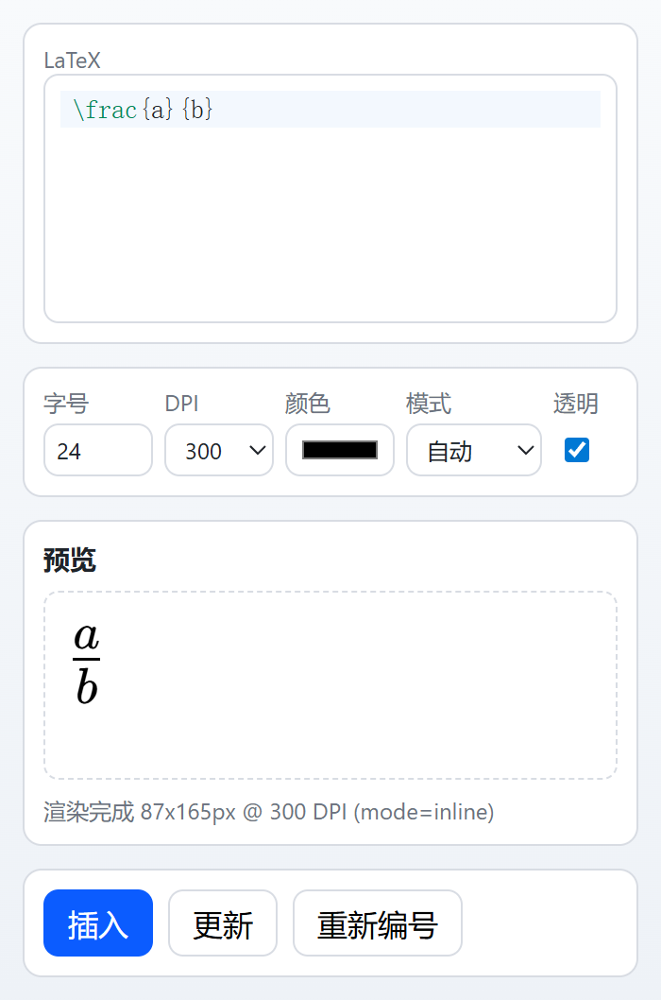

# SlideTeX

一个PowerPoint公式插件，将LaTeX公式渲染为 PNG 图片插入PowerPoint。

`状态`：原型 / 持续开发中（非生产可用）

语言： [English](README.md) | **简体中文**

## 功能概览

- 在PowerPoint任务窗格中输入 LaTeX、预览、插入、更新。
- 公式以 PNG 形式嵌入到 PPT，在未安装插件的电脑上也可以显示。
- 通过Shape元数据保存公式信息，支持回填编辑与更新。
- 采用 MathJax 作为渲染核心，不需要本地安装 LaTeX；图片导出链路为 MathJax -> SVG -> PNG。
- 采用CodeMirror 6作为编辑器，支持语法高亮和补全。

## 截图



## 仓库结构

- `src/SlideTeX.VstoAddin`: VSTO 插件运行时代码。
- `src/SlideTeX.WebUI`: 任务窗格 HTML/CSS/JS 与静态资源。
- `src/SlideTeX.Installer`: WiX 安装器项目。
- `scripts`: 构建、打包、资源同步脚本。
- `tests`: 全部测试脚本与用例。
  - `tests/render-regression`: 渲染视觉回归基线与用例。
  - `tests/equation-numbering`: 编号回归 known-good 用例。
  - `tests/ocr-baseline`: OCR 图片-公式 known-pairs 基线用例。
  - `tests/lib`: 共享测试基础设施工具。
- `docs`: 调试、部署、回归说明文档。

## 环境要求

### 运行
- Windows 10/11
- Microsoft 365 PowerPoint（桌面版）。理论上支持 2016/2019/2021/LTSC，未经测试。
- .NET Framework `4.8` Runtime
- WebView2 Runtime

### 构建
- Node.js
- .NET Framework `4.8` Developer Pack
- Visual Studio 2022（或随附 MSBuild）
- WiX Toolset `6.0.2`
- WiX 扩展 `WixToolset.BootstrapperApplications.wixext`（用于统一多语言 `.exe` 安装包）

```powershell
wix extension add -g WixToolset.BootstrapperApplications.wixext/6.0.2
```

## 快速开始

1. 同步第三方资源：

```powershell
pwsh ./scripts/Sync-MathJax.ps1 -Version 4.1.0
```

同步 pix2text-mfr OCR 模型文件（从 Hugging Face 下载）：

```powershell
pwsh ./scripts/Sync-MathJax.ps1 -Component pix2text-mfr -Pix2TextModelId "breezedeus/pix2text-mfr-1.5"
```

一次同步全部已支持第三方资源：

```powershell
pwsh ./scripts/Sync-MathJax.ps1 -Component all
```

2. 当 `src/SlideTeX.WebUI/assets/i18n/*.json` 变更后，生成 i18n 内联资源：

```powershell
node ./scripts/generate-webui-i18n-bundle.mjs
```

3. 构建解决方案：

```powershell
& "C:\Program Files\Microsoft Visual Studio\2022\Community\MSBuild\Current\Bin\MSBuild.exe" SlideTeX.sln /m:1
```

4. 在浏览器中预览 WebUI（mock host）：

直接在浏览器中打开 `src/SlideTeX.WebUI/index.html`。内置的 `mock-host.js` 会为所有宿主桥接方法提供轻量 stub，调用信息输出到控制台。

## 常用构建与测试命令

- 构建安装包：

```powershell
pwsh ./scripts/Build-Installer.ps1 -Configuration Release -Platform x64
```

当同时构建 `zh-CN` 与 `en-US` 时，脚本会生成：

- 语言拆分的 MSI（内部产物）；
- 一个统一对外发布的 `.exe` 安装包，默认按系统语言选择。

安装时可通过参数覆盖语言：

```powershell
.\SlideTeX-<version>-Release-x64.exe SlideTeXInstallerCulture=en-US
.\SlideTeX-<version>-Release-x64.exe SlideTeXInstallerCulture=zh-CN
```

- 构建安装产物，并覆盖 VSTO 清单签名证书指纹（用于 CI 临时证书场景）：

```powershell
pwsh ./scripts/Build-Installer.ps1 -Configuration Release -Platform x64 -VstoManifestCertificateThumbprint "<THUMBPRINT>"
```

- 单元测试（纯函数，无浏览器）：

```powershell
node tests/test-app-logic.mjs
node tests/test-i18n.mjs
node tests/test-ocr-latex-postprocess.mjs
```

- WebUI 集成测试（Puppeteer + mock host）：

```powershell
node tests/test-main-flow.mjs
```

- WebView2 桥接集成测试：

```powershell
node tests/test-webview2-flow.mjs
```

- PowerPoint 烟雾测试：

```powershell
pwsh ./tests/Invoke-PowerPointSmoke.ps1
```

- 编号 known-good 回归：

```powershell
pwsh ./tests/Test-EquationNumberingKnownGood.ps1 -Configuration Debug
```

- 渲染 known-good（快速/完整）：

```powershell
node tests/render-known-good.mjs --mode verify --suite smoke
node tests/render-known-good.mjs --mode verify --suite full
```

- 从渲染基线生成 OCR known-pairs fixture：

```powershell
node ./tests/build-ocr-baseline-fixture.mjs
```

- OCR baseline（快速/完整）：

```powershell
pwsh ./tests/Test-OcrBaseline.ps1 -Configuration Debug -Suite smoke -ModelDir "C:\models\pix2text-mfr"
pwsh ./tests/Test-OcrBaseline.ps1 -Configuration Debug -Suite full -ModelDir "C:\models\pix2text-mfr"
```

- MSI 生命周期测试（安装旧版 → 升级 → 卸载）：

```powershell
pwsh ./tests/Test-MsiLifecycle.ps1 -OldMsi <path> -NewMsi <path>
```

## CI/CD

仓库目前内置一个 GitHub Actions 工作流：

- `.github/workflows/ci-build.yml`：在 push/PR 时构建安装产物并上传为 CI artifact。

该工作流会自动生成临时代码签名证书，并把指纹传入 `Build-Installer.ps1` 生成 VSTO 清单。

## 部署与文档

- 调试指南：`docs/DEBUG_GUIDE.md`
- 管理员部署：`docs/ADMIN_DEPLOYMENT.md`
- 回归测试说明：`docs/REGRESSION_TESTS.md`

## 当前限制

- 仅支持 Windows PowerPoint。
- 仅保证当前渲染链路覆盖的公式能力，不覆盖完整 TeX/LaTeX 生态。
- 仓库不包含完整的生产签名与发布流程。

## 第三方组件说明

以下为项目当前使用到的主要第三方组件（含版本与协议）：

| 组件 | 版本 | 协议 | 用途 |
| --- | --- | --- | --- |
| MathJax | `4.1.0` | Apache-2.0 | 公式渲染与 SVG 输出（运行时，vendored 到 `src/SlideTeX.WebUI/vendor/mathjax`） |
| CodeMirror | `6.0.2` | MIT | 编辑器核心（运行时，打包到 `src/SlideTeX.WebUI/assets/js/editor-adapter.js`） |
| @codemirror/legacy-modes | `6.5.2` | MIT | 编辑器语法模式（构建时打包） |
| pixelmatch | `7.1.0` | ISC | 渲染回归图像 diff（测试） |
| pngjs | `7.0.0` | MIT | PNG 读写（测试） |
| puppeteer-core | `24.31.0` | Apache-2.0 | 浏览器自动化（渲染回归测试） |
| rollup | `4.57.1` | MIT | CodeMirror 构建打包（开发时） |
| @rollup/plugin-node-resolve | `16.0.3` | MIT | Rollup 依赖解析（开发时） |

说明：
- 以上版本来自仓库固定脚本/配置（`package.json`、`src/SlideTeX.WebUI/vendor/codemirror/VERSIONS.md`）。
- 以上协议信息来自对应上游包元数据；完整法律文本请以各组件官方仓库与发行包为准。
- `src/SlideTeX.VstoAddin/Assets/OcrModels` 下 OCR 模型二进制默认不提交 git，建议通过 `scripts/Sync-MathJax.ps1` 同步。

## 开源协议

项目采用 MIT 协议，详见 `LICENSE`。
